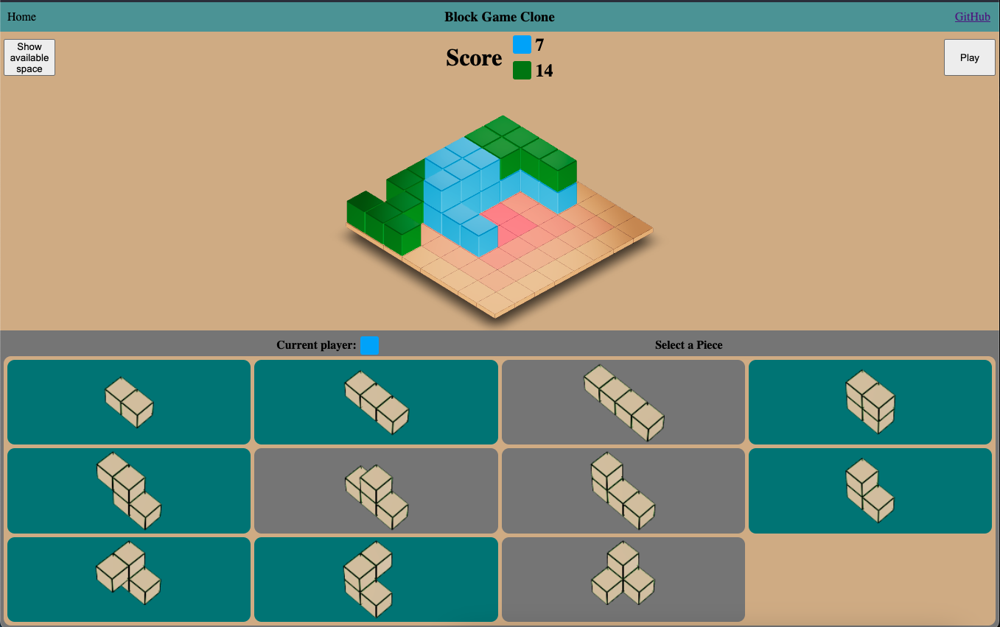

# block_game_clone

Hosted: https://ethanse.github.io/block_game_clone/

A web-based clone of an existing board game. Allows for two player or vs computer play.

# Front End

TypeScript

React

React Three Fiber (React binding for Three.js)

# Back End

Rust compiled to WebAssembly https://github.com/ethanSE/block-game-clone-backend
